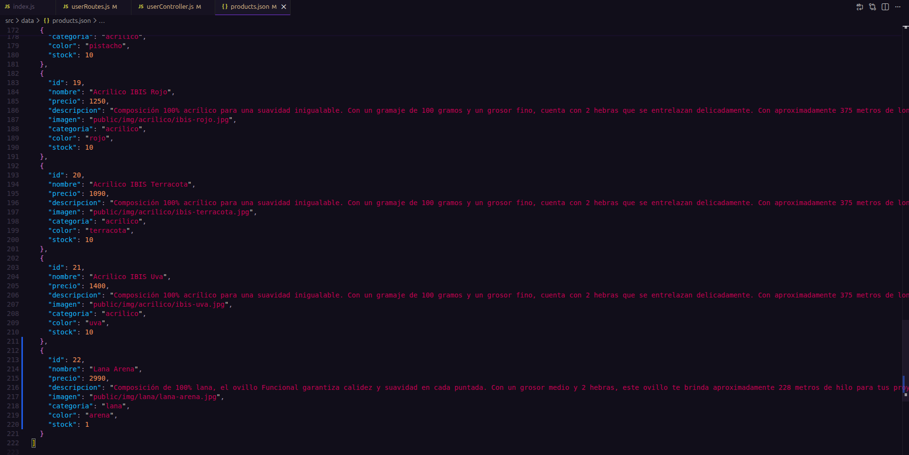
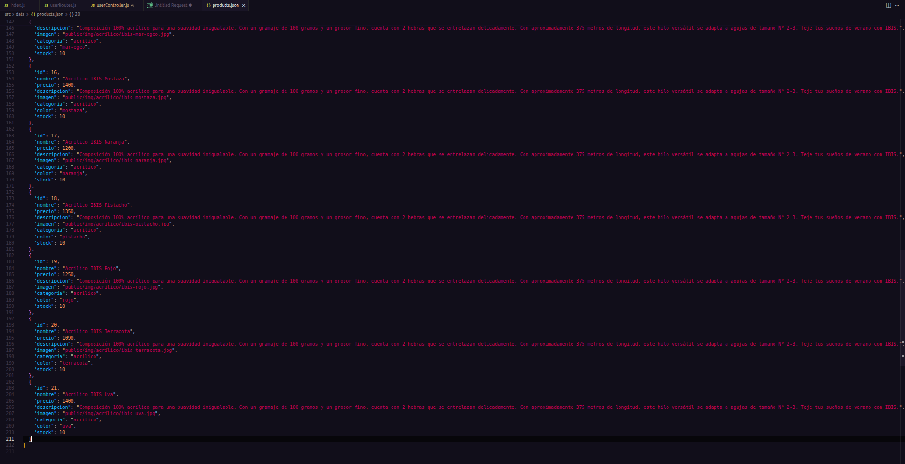
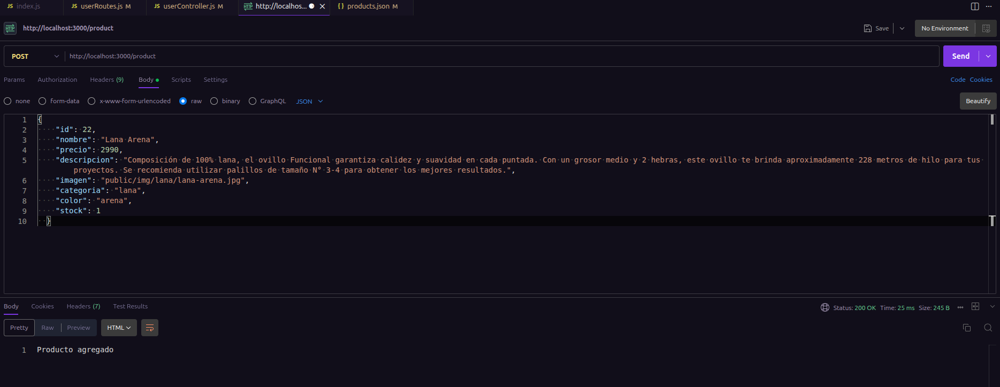
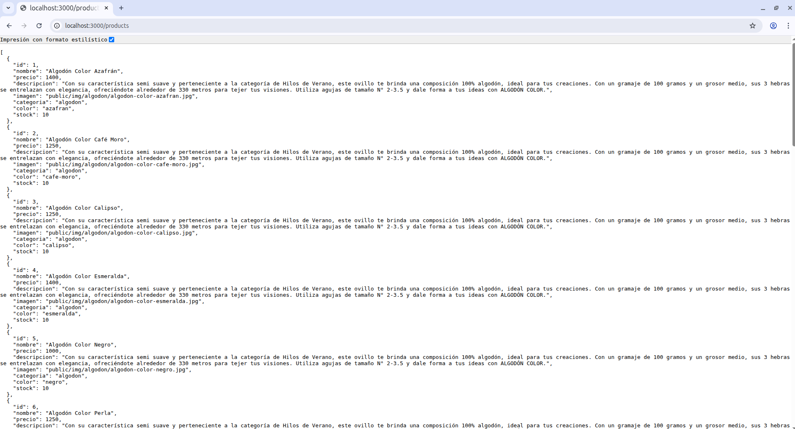

# WebApp con Node/Express

**Proyecto educativo: API REST simple con Node.js, Express y endpoints GET/POST.**

Desarrollado por [Catwebs](https://github.com/CatWebs) en 2026.

## 📋 Índice

- [Descripción](#descripción)
- [Instalación](#instalación)
- [Uso](#uso)
- [Endpoints](#endpoints)
- [Tecnologías](#tecnologías)
- [Autor](#autor)
- [Licencia](#licencia)

## Descripción

Esta es una API básica para practicar desarrollo backend. Incluye servidor Express con rutas GET y POST para manejar datos (ej. usuarios o productos). Conecta a base de datos (por definir). Este proyecto forma parte del bootcamp "Fullstack Javascript Trainee" impartido por Sence y [Talento Digital para Chile](https://talentodigitalparachile.cl/)

## Instalación

1. Clona el repo:
   git clone https://github.com/CatWebs/FullStack_SENCE_WebApp.git

2. Instala dependencias:
   npm install

3. Crea `.env` con tus variables (En esta etapa sólo tenemos el puerto):
   PORT=3000

4. Levanta el servidor:
   npm run dev

¡Listo! Abre http://localhost:3000.

## Uso

Puedes probar agregando un producto o un usuario. El siguiente ejemplo muestra como agregar un producto.

1. Conociendo el archivo .json
   

2. Comprobando ruta /products
   

3. Mediante Postman hago la solicitud POST y recibo una respuesta "Producto agregado"
   

4. Compruebo el archivo .json y veo un nuevo producto
   

**Prueba con Postman o Thunder Client en VS Code.**

## Endpoints

| Método | Endpoint  | Descripción               |
| ------ | --------- | ------------------------- |
| GET    | /products | Lista todos los productos |
| POST   | /product  | Agrega un nuevo producto  |
| GET    | /users    | Lista todos los usuarios  |
| POST   | /user     | Agrega un nuevo usuario   |

## Tecnologías

- Node.js
- Express.js
- dotenv (variables de entorno)
- nodemon (dev)

## Autor

Catwebs | Catalina Cisternas
[GitHub](https://github.com/CatWebs) | [LinkedIn](https://www.linkedin.com/in/catalina-cisternas-torres/)

## Licencia

Proyecto bajo Licencia MIT. ¡Puedes usarlo libremente con crédito!
